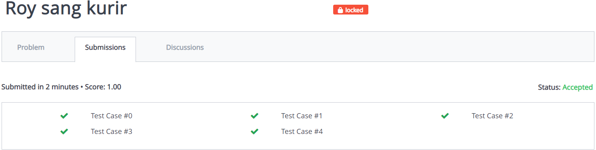

# struktur-data-h-praktikum-4-2021
## Roy Sang Kurir
### Verdict
AC Perbaikan
### Bukti

### Penjelasan Soal
Diberikan sebuah undirected graph, program diminta menentukan apakah graph memiliki cycle.
### Penjelasan Solusi
DFS dapat digunakan untuk menemukan cycle dalam undirected graph. Cara kerjanya adalah setiap node saat traversal DFS akan melihat node-node neighbor nya. Jika node neighbor tersebut sudah dilalui dan bukan parent dari node itu sendiri, maka terdapat cycle dalam graph.
## Cayo Refreshing
### Verdict
WA
### Bukti
### Penjelasan Soal
Diberikan undirected unconnected graph dengan ``T`` vertex dan ``L`` edge yang sebagai pulau dan jembatan yang menghubungkan. Program diminta mencari jumlah jembatan untuk menghubungkan semua pulau.
### Penjelasan Ide
Menggunakan DFS untuk mengihtung banyak node yang terhubung lalu mengoutputkan jumlah jembatan minimum sesuai dengan rumpun node
## Sayonara
### Verdict
WA
### Bukti
### Penjelasan Soal
Diberikan papan permainan seperti yang ada di soal. Program diminta mencetak langkah-langkah dari lokasi ``P`` ke ``Q``. Setiap langkah dengan format xY, x adalah jarak ditempuh, Y adalah arah.
### Penjelasan Ide

## Puzzle MudMud
### Verdict
WA
### Bukti
### Penjelasan Soal
Diberikan beberapa 8 angka puzzle yang belum terselesaikan.
Program diminta menentukan banyak langkah dan mencetak tiap langkah untuk menyelesaikan puzzle jika bisa, jika tidak keluarkan "Problem tidak dapat diselesaikan".
### Penjelasan Ide

## Malur Javanese Ngulski
### Verdict
WA
### Bukti
### Penjelasan Soal
Diberikan ``n`` rumah dengan properti (``x``, ``y``) sebagai lokasi tiap rumah, dan ``h``, tingkat kerumitan. Program diminta menghitung biaya minimum untuk menghubungkan tiap rumah. Setiap jalan antara dua rumah dihitung dengan rumus ``euclidian(x,y) * Δh``.
### Penjelasan Ide
mencari ``minimum spanning tree`` dari graph yang dimaksud, kemudian menghitung total weight dari MST yang terbentuk.
## Distribusi Vaksin
### Verdict
WA
### Bukti
### Penjelasan Soal
Diberikan sebuah graph dengan ``V`` rumah , ``E`` ruas jalan, dan ``Q`` tujuan yang dilalui secara berurutan. Program diminta menentukan waktu minimum untuk mengirim semua vaksin berawal dari Q1.
### Penjelasan Ide
Waktu minimum total dapat dihitung dengan menjumlahkan cost dari waktu minimum antara dua lokasi tujuan, jadi menghitung waktu minimum antara Q1 dan Q2, kemudian antara Q2 dan Q3, Q3 dan Q4, sampai Qn-1 dan Qn
